# AgentForge

> **Live Demo:** [https://agent-omega-tan.vercel.app/](https://agent-omega-tan.vercel.app/)  
> **API Backend:** [https://agentforge-wgmg.onrender.com](https://agentforge-wgmg.onrender.com)

AgentForge is a sophisticated, AI-powered prototyping platform and code generator that turns a plain-English idea into a fully functional, structured multi-agent system. It designs the agent roles, layouts execution workflows, validates schemas, generates backend FastAPI endpoints (complete with databases, tests, and security audits), compiles a modern React/Vite dashboard, and packages everything into a downloadable workspace ZIP.

---

## 🗺️ Architectural Workflow Overview

AgentForge implements a 30-stage, sequential multi-agent execution pipeline. It starts by auditing the user requirements and dynamically deciding whether to launch a clarifying interviewer sequence or proceed to full generation.

```mermaid
graph TD
    UserPrompt([User Prompt]) --> S1[Stage 1: Business Understanding Spec]
    S1 --> Decision{Confidence Score?}
    Decision -->|Low/Medium| S2[Stage 2: Clarification Interviewer]
    S2 -->|User Answers| S1
    Decision -->|Acceptable/High| S3[Stage 3: Multi-Agent System Planner]
    
    subgraph Architecture & Flow Design
        S3 --> S4[Stage 4: Agent Role Verifier]
        S4 --> S5[Stage 5: Workflow Topology Designer]
        S5 --> S6[Stage 6: Workflow Deadlock Validator]
        S6 --> S7[Stage 7: Workflow Latency Optimizer]
    end
    
    subgraph Prompt & Tool Integration
        S7 --> S8[Stage 8: Prompt Synthesis Engineer]
        S8 --> S9[Stage 9: Prompt QA Inspector]
        S9 --> S10[Stage 10: Core Tool Capability Mapper]
        S10 --> S11[Stage 11: Tool Parameter Validator]
    end
    
    subgraph Backend & DB Generation
        S11 --> S12[Stage 12: Database Schema Architect]
        S12 --> S13[Stage 13: Schema Migration Planner]
        S13 --> S14[Stage 14: Python Code Generator]
        S14 --> S15[Stage 15: REST API Endpoints Builder]
        S15 --> S16[Stage 16: Core Logic Generator]
        S16 --> S17[Stage 17: Environment Setup Agent]
    end
    
    subgraph User Interface & Presentation
        S17 --> S18[Stage 18: UI Component Designer]
        S18 --> S19[Stage 19: UI Component Reviewer]
    end
    
    subgraph Verification & Testing
        S19 --> S20[Stage 20: Test Generator]
        S20 --> S21[Stage 21: Mock Data Generator]
        S21 --> S22[Stage 22: Doc Generator]
        S22 --> S23[Stage 23: Architecture Diagrammer]
    end
    
    subgraph Code Sanitization & Delivery
        S23 --> S24[Stage 24: Security Analyzer]
        S24 --> S25[Stage 25: Credential Leak Detector]
        S25 --> S26[Stage 26: Dependency Auditor]
        S26 --> S27[Stage 27: Lint Healer]
        S27 --> S28[Stage 28: Performance Analyzer]
        S28 --> S29[Stage 29: Package Manifest Verifier]
        S29 --> S30[Stage 30: Compilation Report Compiler]
    end
    
    S30 --> Output([FastAPI + React ZIP Package])
```



---

## 🛠️ The 30-Stage Multi-Agent Pipeline

1. **Business Understanding (Requirement Analysis)**: Extracts goals, tasks, constraints, assumptions, and confidence ratings from the user's initial prompt.
2. **Clarification Agent**: If confidence is low or medium, pauses the generator to ask targeted clarifying questions.
3. **Agent Planner**: Determines how many agents are needed, their identifiers, exact responsibilities, and operational capabilities.
4. **Agent Role Verifier**: Validates roles, checks for overlapping scopes, and resolves systemic identity conflicts.
5. **Workflow Designer**: Maps out the step-by-step communication graph (edges, nodes, triggers) connecting the agents.
6. **Workflow Deadlock Validator**: Evaluates workflow paths for infinite loops, race conditions, or unresolvable wait states.
7. **Workflow Latency Optimizer**: Identifies paths that can run concurrently rather than sequentially.
8. **Prompt Generator**: Synthesizes custom system prompts, context parameters, and response-formatting instructions for each agent.
9. **Prompt Reviewer**: Audits prompts for clarity, leakage vulnerabilities, and instruction compliance.
10. **Tool Selector**: Suggests API calls, helper utilities, or third-party web tools each agent should possess.
11. **Tool Parameter Validator**: Double-checks tool parameters against standard OpenAPI schema constraints.
12. **Database Architect**: Designs database tables (`models.py`) and setup guidelines.
13. **Database Migration Planner**: Synthesizes setup scripts (e.g., Alembic migrations) and seeds dummy mock records.
14. **Code Generator**: Generates clean Python modular blueprints matching each agent's custom functionality.
15. **API Endpoints Generator**: Designs FastAPI endpoints (`main.py` routes) to orchestrate and query the agent nodes.
16. **Core Logic Generator**: Implements main algorithmic scripts and helper operations.
17. **Environment Setup Agent**: Automatically creates dependencies list (`requirements.txt`), lock files, and `.env.example` templates.
18. **UI Component Designer**: Builds a responsive visual single-page dashboard (`index.html`) using HTML5 and Tailwind CSS.
19. **UI Component Reviewer**: Validates layouts, interactive buttons, accessibility tags, and alignment.
20. **Test Generator**: Synthesizes a structured `pytest` suite testing all generated routes and database interactions.
21. **Mock Data Generator**: Creates mock database records, JSON payloads, and dummy API responses for validation runs.
22. **Doc Generator**: Auto-generates detailed markdown guides describing the generated architecture (`API_DOCUMENTATION.md`).
23. **Architecture Diagrammer**: Exports visual diagrams using Mermaid graphing notation (`ARCHITECTURE_DIAGRAM.md`).
24. **Security Analyzer**: Audits files against standard OWASP vulnerabilities and security gaps (`SECURITY_AUDIT.json`).
25. **Credential Leak Detector**: Scans source files and configuration items to prevent API keys or credential leakage.
26. **Dependency Auditor**: Runs check audits on selected packages to prevent supply-chain vulnerabilities.
27. **Lint Healer**: Reformats generated code blocks and ensures PEP8 syntax compliance.
28. **Performance Analyzer**: Investigates database queries and loops to highlight potential latency bottlenecks.
29. **Package Manifest Verifier**: Validates configuration integrity and packages metadata files.
30. **Compilation Report Compiler**: Wraps all status indicators, files, schemas, and metrics into a unified generation report.

---

## ⚡ Robust LLM Orchestration & Failovers

All LLM calls transit through a unified client wrapper in [llm_client.py] which implements high reliability strategies:

* **Primary Providers**:
  * **Groq (`llama-3.3-70b-versatile`)**: Used for quick structured reasoning, planning schemas, and general flow design.
  * **Google GenAI (`gemini-3.5-flash`)**: Used for rendering high-fidelity source code files, React/Tailwind scripts, and documentation where larger contexts are necessary.
* **Double-Sided Failover**:
  * If a request to Groq fails (or produces malformed JSON), the client automatically catches the error, triggers one retry, and, if it fails again, falls back to Gemini.
  * If a request to Gemini fails, it similarly retries and falls back to Groq.
* **Secondary Backups**:
  * Both primary providers fall back to smaller models (`llama-3.1-8b-instant` or `gemini-2.0-flash`) during rate limits or transient errors.
  * If both networks fail, the client can fall back to **OpenRouter** if configured in the environment.

---

## 📂 Project Structure

```text
Agentverse/
├── AGENT/                           # FastAPI Backend Service
│   ├── main.py                      # Application routing, simulation sandbox, and endpoints
│   ├── llm_client.py                # Central LLM client with automatic failover orchestration
│   ├── requirements.txt             # Python backend dependencies
│   ├── .env.example                 # Template for API credentials
│   ├── scratch/                     # Sandbox workspace directory for running simulations
│   └── table/                       # Multi-agent modular subcomponents
│       ├── agents/                  # Code files for all 30 stage-agents
│       ├── schemas/                 # Pydantic schemas mapping the execution context
│       └── validators/              # Validation models
│
├── agentforge-frontend/             # React + Vite UI
│   ├── src/
│   │   ├── main.jsx                 # App Entrypoint
│   │   ├── App.jsx                  # Main application state, canvas manager, and tabs
│   │   ├── index.css                # Style overrides and Tailwind imports
│   │   ├── api.js                   # API caller functions (generate, continue, simulate, refine)
│   │   └── components/              # Reusable UI widgets and panels
│   │       ├── SidebarNav.jsx       # Layout navigation (Build, Settings, About)
│   │       ├── InputPanel.jsx       # Form for sending prompts and answering clarifications
│   │       ├── PipelineTrace.jsx    # Real-time streaming status tracker for the 30 stages
│   │       ├── SimulationCanvas.jsx # Interactive testing panel for executing generated code
│   │       ├── CodeSheet.jsx        # Code editor using Monaco Editor
│   │       ├── WorkflowSheet.jsx    # Visual network graph generated using React Flow
│   │       └── ...                  # Other sheets for Business specs, Prompts, and Tools
│   ├── package.json                 # Node project configuration
│   └── vite.config.js               # Vite bundler parameters
│
└── README.md                        # Project documentation (this file)
```

---

## 📡 API Reference

### 1. Generate Multi-Agent System
* **Endpoint**: `POST /generate`
* **Content-Type**: `application/json`
* **Request Payload**:
  ```json
  {
    "user_input": "Build a Smart Campus energy management system that coordinates solar power usage and classroom AC schedules."
  }
  ```
* **Response**: A Server-Sent Event (SSE) stream returning JSON chunks representing pipeline progression. If requirement ambiguity is detected, returns `status: "needs_clarification"` with questions:
  ```json
  data: {
    "status": "needs_clarification",
    "business_spec": { ... },
    "questions": [
      "Should the energy system support real-time user overrides from students?",
      "Do we integrate with existing weather forecast APIs?"
    ],
    "round": 1
  }
  ```

### 2. Continue Generation after Clarification
* **Endpoint**: `POST /generate/continue`
* **Content-Type**: `application/json`
* **Request Payload**:
  ```json
  {
    "user_input": "Build a Smart Campus energy management system...",
    "answers": [
      { "question_idx": 0, "answer": "Yes, override support is critical." },
      { "question_idx": 1, "answer": "Yes, integrate with OpenWeather API." }
    ],
    "round": 1
  }
  ```
* **Response**: Resumes the SSE pipeline stream and executes Stages 3 to 30.

### 3. Refine Project Codebase
* **Endpoint**: `POST /generate/refine`
* **Content-Type**: `application/json`
* **Request Payload**:
  ```json
  {
    "generated_code": { "main.py": "...", "agents/planner.py": "..." },
    "business_spec": { ... },
    "architecture": { ... },
    "workflow": { ... },
    "instruction": "Add an authentication helper agent to check token headers."
  }
  ```
* **Response**: Returns updated code dictionary, architecture, and workflow:
  ```json
  {
    "status": "complete",
    "result": {
      "generated_code": { ...healed code files... },
      "architecture": { ...updated agents list... },
      "workflow": { ...updated execution edges... }
    }
  }
  ```

### 4. Sandboxed Execution (Simulation)
* **Endpoint**: `POST /generate/simulate`
* **Content-Type**: `application/json`
* **Request Payload**:
  ```json
  {
    "generated_code": { "main.py": "...", "models.py": "..." },
    "input_data": { "classroom": "101", "solar_kwh": 45.2 }
  }
  ```
* **Response**: Streams a sandboxed shell stdout. Initializes a localized test folder, writes files, sets up a virtual `TestClient(app)`, queries `/run` with input data, records logs, and safely cleans up directory artifacts.

### 5. Codebase Explanation
* **Endpoint**: `POST /generate/explain`
* **Content-Type**: `application/json`
* **Request Payload**:
  ```json
  {
    "generated_code": { ... },
    "business_spec": { ... },
    "architecture": { ... },
    "workflow": { ... },
    "question": "How do the solar coordinator agent and AC controller communicate?"
  }
  ```
* **Response**: Returns a detailed markdown explanation compiled by Gemini.

### 6. Fast Download ZIP
* **Endpoint**: `GET /download-project`
* **Query Params**: `user_input` (String)
* **Response**: Directly runs the pipeline and outputs a downloadable `.zip` file of the generated project.

---

## 🚀 Installation & Local Setup

### System Prerequisites
* Python 3.9+
* Node.js 18+

### 1. Setup Backend
Open your terminal, navigate to the `AGENT` directory:
```bash
cd AGENT
```
Create and activate a virtual environment:
```bash
# On Windows
python -m venv .venv
.venv\Scripts\activate

# On macOS/Linux
python3 -m venv .venv
source .venv/bin/activate
```
Install dependencies:
```bash
pip install -r requirements.txt
```
Create a `.env` file:
```bash
copy .env.example .env   # Windows
cp .env.example .env     # macOS/Linux
```
Configure your api keys inside `.env`:
```env
GROQ_API_KEY=gsk_your_groq_api_key_here
GEMINI_API_KEY=AIzaSy_your_gemini_api_key_here
```
Run the FastAPI development server:
```bash
python -m uvicorn main:app --reload
```
The interactive API documentation is available at `http://127.0.0.1:8000/docs`.

### 2. Setup Frontend
Navigate to the `agentforge-frontend` directory:
```bash
cd agentforge-frontend
```
Install dependencies:
```bash
npm install
```
Start the development server:
```bash
npm run dev
```
Open the application on `http://localhost:5173`. Go to the **Settings** tab in the sidebar and ensure the API Base URL is pointed to the backend service: `http://127.0.0.1:8000`.

---

## ☁️ Production Deployment

AgentForge is built to be easily deployed on standard cloud hosting platforms.

### 🌐 Live Demo
* **Frontend Dashboard (Vercel):** [https://agent-omega-tan.vercel.app/](https://agent-omega-tan.vercel.app/)
* **Backend API Server (Render):** [https://agentforge-wgmg.onrender.com](https://agentforge-wgmg.onrender.com)

### 1. Deploying Backend on Render
1. Connect your GitHub repository to [Render.com](https://render.com/).
2. Create a new **Web Service**.
3. Set the **Root Directory** to `AGENT` (case-sensitive).
4. Configure the **Build Command** to `pip install -r requirements.txt`.
5. Configure the **Start Command** to `uvicorn main:app --host 0.0.0.0 --port 10000`.
6. Add environment variables for `GROQ_API_KEY`, `GEMINI_API_KEY`, and `OPENAI_API_KEY` (comma-separated rotation keys) or leave them blank to let users supply their own keys in the browser Settings.

### 2. Deploying Frontend on Vercel
1. Connect your GitHub repository to [Vercel.com](https://vercel.com/).
2. Set the **Root Directory** to `agentforge-frontend`.
3. Select `Vite` as the framework preset.
4. Add the environment variable `VITE_API_BASE` pointing to your deployed Render service (e.g. `https://agentforge-wgmg.onrender.com`).
5. Click **Deploy**.

---

## ⚡ Key Development Capabilities & Sandbox Simulation

* **Canvas Visualization**: The frontend leverages `React Flow` to draw structural architecture topologies. You can visually inspect connections and nodes as the pipeline runs.
* **Monaco Editor Support**: Read, explore, and edit generated code dynamically. Any updates made in the browser can be passed back into the sandboxed simulator.
* **Sandboxed Simulation**: The simulation route runs the generated FastAPIs inside a temporary workspace, shielding the parent server from execution leakage while providing feedback logs directly to the user dashboard.
* **Self-Healing Loop**: If you ask the backend to add an agent or capability, the system automatically checks for stub implementations or missing dependencies and triggers localized self-healing cycles to heal the code.
